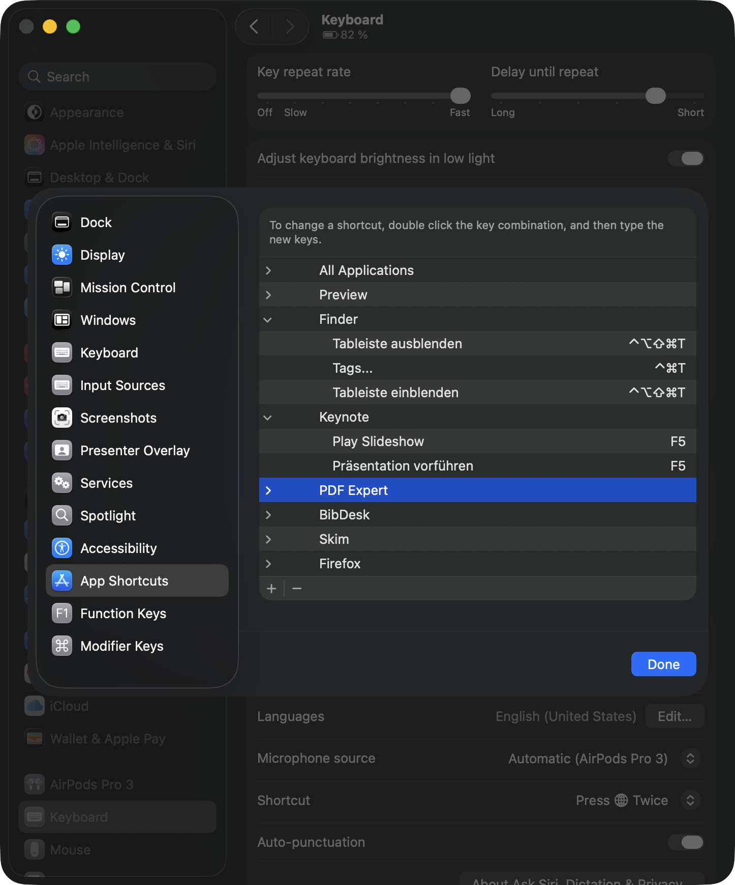

# macOS Hotkey Manager

A Python script to **export**, **import**, and **reset** macOS application hotkeys using the `defaults` system.

## 🎯 What is this tool for?

To easily transfer your custom keyboard shortcuts across macOS machines or back them up for safety.

## 📌 What it covers

This tool exports and imports exactly the shortcuts listed under **System Settings →
Keyboard → Keyboard Shortcuts… → App Shortcuts** — the per-app menu-item overrides, plus the
**All Applications** group:



It does **not** touch the other categories in that same list (Mission Control, Spotlight,
Screenshots, Services, Function Keys, etc.); macOS stores those separately, in
`com.apple.symbolichotkeys`. So if you have only customized shortcuts from those other
categories, `--export` will correctly produce an empty file.

## ✨ Features

- ✅ Export all user-defined hotkeys (menu item shortcuts) to a JSON file
- ✅ Import them on another machine or after a reinstall
- ✅ Intelligent conflict detection (with `--force` overwrite option)
- ✅ Full reset of all configured hotkeys (with user confirmation)
- ✅ Automatically refreshes `cfprefsd` to apply changes immediately
- ✅ Handles shortcuts on submenu items, whose menu paths contain control characters
- ✅ Clean, type-annotated Python code

---

## 🚀 Usage

Make sure your system has Python 3 installed (pre-installed on macOS), then run:

```bash
chmod +x hotkeys-manager.py
./hotkeys-manager.py [option]
```

### Export custom hotkeys

```bash
./hotkeys-manager.py --export my_hotkeys.json
```

This will create a JSON file with all current app-specific and global hotkeys.

---

### Import hotkeys from file

```bash
./hotkeys-manager.py --import my_hotkeys.json
```

By default, the script **does not overwrite** any existing hotkey entries that differ. It skips them with a warning.

To forcefully overwrite all conflicting entries:

```bash
./hotkeys-manager.py --import my_hotkeys.json --force
```

`--import` (and `--reset`) report their outcome through the exit code:

| Code | `--import` | `--reset` |
|------|------------|-----------|
| `0`  | All hotkeys written and the apps registered in System Settings. | All hotkeys removed and the App Shortcuts list cleared. |
| `2`  | Hotkeys written and **active**, but registering the apps in **App Shortcuts** was rejected — they work, they just won't show up there (see [Troubleshooting](#-troubleshooting)). | Hotkeys removed, but the **App Shortcuts** list couldn't be cleared, so those apps may still appear there. |
| `1`  | One or more hotkeys could **not** be written; those shortcuts are not in effect. | One or more hotkeys could **not** be removed; those shortcuts are still active. |

---

### Reset all hotkeys

```bash
./hotkeys-manager.py --reset
```

This deletes:
- All `NSUserKeyEquivalents` entries from every app listed
- The global `com.apple.custommenu.apps` tracker

✅ You will be asked for confirmation before the reset is applied.

---

## 💡 How It Works

macOS stores custom menu shortcuts in `NSUserKeyEquivalents` dictionaries in `defaults` for each app. These are tracked centrally via:

```
com.apple.universalaccess → com.apple.custommenu.apps
```

The **All Applications** entry in that pane is not a real app — it is the `NSGlobalDomain`
pseudo-domain, and it is exported and imported like any other. It is picked up even when it
is missing from `com.apple.custommenu.apps`, which happens when a global shortcut was set
directly with `defaults write -g NSUserKeyEquivalents …` rather than through System Settings.

This tool:
- Reads from those domains via `defaults export` into a binary property list, which
  keeps values that XML cannot represent (see [Submenu shortcuts](#submenu-shortcuts))
- Outputs valid JSON
- Imports them back while preserving existing entries (unless `--force` is used)
- Writes each value as an XML property list, so menu titles containing quotes,
  backslashes, or non-ASCII characters (`Vorwärts`, `Präsentation vorführen`) survive
  the round trip intact, falling back to the old-style plist format for menu paths,
  which XML cannot carry
- Verifies every write by reading it back, and exits non-zero if anything failed
- Reloads the system preference daemon (`cfprefsd`) to apply changes immediately

### Submenu shortcuts

A shortcut on a top-level menu item needs only that item's title. To reach an item inside a
**submenu**, type the whole path with `->`. For example, **Keynote** has `Show Fonts` inside
`Format` → `Font`, so you enter it as:

```
Format->Font->Show Fonts
```

macOS does not store that arrow. It stores an **ESC** character (`0x1b`) in front of every
component, so the stored key becomes:

```
\x1bFormat\x1bFont\x1bShow Fonts
```

Two consequences:

- Exported JSON contains `\u001b` escapes for such shortcuts. That is correct, and those
  entries can be edited by hand.
- Warnings print them back in the readable `Format->Font->Show Fonts` form.

---

## 🧯 Troubleshooting

### `Could not write domain com.apple.universalaccess; exiting`

Some users have reported that writing to `com.apple.universalaccess` — the domain that
registers apps in **System Settings → Keyboard → Keyboard Shortcuts… → App Shortcuts** — is
rejected with this message, apparently due to a TCC sandbox restriction on that domain (see
[#3](https://github.com/alberti42/macOS-hotkeys-manager/issues/3)). When it happens,
`--import` reports it, lists the affected apps, and exits non-zero. The per-app
`NSUserKeyEquivalents` writes still succeed, but the affected apps won't show up in the App
Shortcuts list until their bundle IDs are registered.

Two workarounds appear to help:

1. **Register the apps through the GUI.** Open **System Settings → Keyboard → Keyboard
   Shortcuts… → App Shortcuts → +** and add **one** shortcut for each affected app; macOS
   registers the bundle ID for you. Then run `--import` **again** — the App Shortcuts pane
   rewrites `NSUserKeyEquivalents` wholesale and can drop entries the import already wrote,
   so re-running restores them.

2. **Disable SIP.** With System Integrity Protection turned off, `--import` writes
   `com.apple.universalaccess` without any rejection (observed on macOS 26.5.2). Disabling
   SIP lowers your system's security, so this is **not recommended** unless you make it a
   conscious decision — or disable it just for the one-off import and re-enable it
   immediately afterward.

You can check your current SIP status with:

```bash
csrutil status
```

If you hit this rejection, please report your macOS version, whether SIP is enabled or
disabled (see above), and whether either workaround helped on
[#3](https://github.com/alberti42/macOS-hotkeys-manager/issues/3) — the exact conditions
under which the write is allowed are not yet established.

---

## 📦 Requirements

- macOS 10.10 or newer
- Python 3.x
- No third-party packages needed

---

## 📎 Example Workflow

```bash
# On your main machine
./hotkeys-manager.py --export my_hotkeys.json

# Copy file to a second machine (e.g., via AirDrop, scp, email, usb stick, Git, etc.)
scp my_hotkeys.json user@newmac.local:~

# On the second machine
./hotkeys-manager.py --import my_hotkeys.json
```

---

## 🛡️ Safety Notes

- No system-level files are touched — only user preferences.
- `killall -u "$USER" cfprefsd` is called automatically to refresh changes without
  requiring logout. It is scoped to your own user, so the root-owned daemon is untouched.
- Writes only ever replace the `NSUserKeyEquivalents` key of an app's domain; any other
  preferences that app stores are left alone.

---

## 🛠️ Future Ideas

- 🔄 Dry-run mode to preview changes before importing
- 🌐 iCloud or dotfiles integration
- 🖼 GUI interface for visual editing
- 🧪 Unit tests for parsing and applying changes

---

## 📃 License

MIT License. Feel free to use, modify, and share.

---

## 🤝 Contributions

Issues and pull requests are welcome! If you improve the logic, add features, or build out tooling, feel free to contribute.

---

Enjoy your portable, controlled hotkey environment! 🍎⌨️
